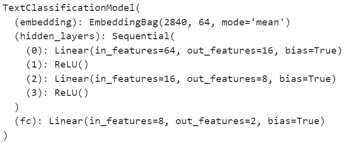
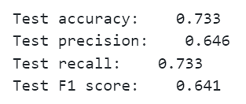
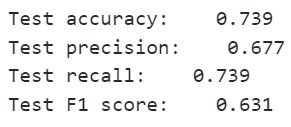

# Experiment Report

## 0. Overview
- Used PyTorch and TorchText to implement a Chinese text sentiment classification task
- Employed an EmbeddingBag + MLP for prediction
- Data preprocessing involved a custom tokenizer and vocabulary

## 1. Data Preprocessing

- Loaded data from a jsonl file
- Removed irrelevant columns, keeping only sentence and label
- Mapped labels to integers, tokenized text, and built a vocabulary

### 1.1 basic Chinese tokenizer

```python
def basic_chinese_tokenizer(text):
    chinese_char_pattern = r'[\u4e00-\u9fff]'  # Unicode range for common Chinese characters
    tokens = re.findall(chinese_char_pattern, text)
    return tokens
```

### 1.2 improved Chinese tokenizer

```python
def improved_chinese_tokenizer(text):
    chinese_char_pattern = r'[\u4e00-\u9fff]'
    digits_pattern = r'\d+'
    english_word_pattern = r'[a-zA-Z]+'
    punctuation_pattern = r'[，。！？、：；（）【】《》“”‘’.,;:!?()\[\]{}]+'
    combined_pattern = f"({chinese_char_pattern}|{digits_pattern}|{english_word_pattern}|{punctuation_pattern})"
    tokens = re.findall(combined_pattern, text)
    return tokens
```

## 2. Model Structure
- Used EmbeddingBag to handle variable-length inputs
- Passed through two fully connected layers with ReLU activation, then a final classification layer
- Employed CrossEntropyLoss as the loss function and SGD as the optimizer

```python
    self.embedding = nn.EmbeddingBag(vocab_size, embed_dim, sparse=False)
    self.hidden_layers = nn.Sequential(
        nn.Linear(embed_dim, hidden_dim1),
        nn.ReLU(),
        nn.Linear(hidden_dim1, hidden_dim2),
        nn.ReLU()
    )
    self.fc = nn.Linear(hidden_dim2, num_class)
```



## 3. Training and Evaluation
- Trained in batches using a DataLoader
- Split the training data into 95% for training and 5% for validation
- Measured validation accuracy after each epoch and adjusted the learning rate
- Evaluated on the test set for final accuracy, precision, recall, and F1 score

```python
# Hyperparameters
EPOCHS = 10  # epoch
LR = 0.01  # learning rate
BATCH_SIZE = 4  # batch size for training
```


## 4. Explore Word Segmentation

- Used Jieba to segment Chinese text

```python
import jieba
def jieba_chinese_tokenizer(text):
    tokens = jieba.lcut(text)
    return tokens
```



- The accuracy of the model trained with Jieba tokenization was higher than that of the model trained with the improved tokenizer.
- The f1 score of the model trained with Jieba tokenization was lower than that of the model trained with the improved tokenizer.

## 6. Conclusion
- Demonstrated effectiveness of EmbeddingBag + MLP for sentiment analysis
- Future improvements could involve deeper architectures (like Transformers) or advanced tokenizers
