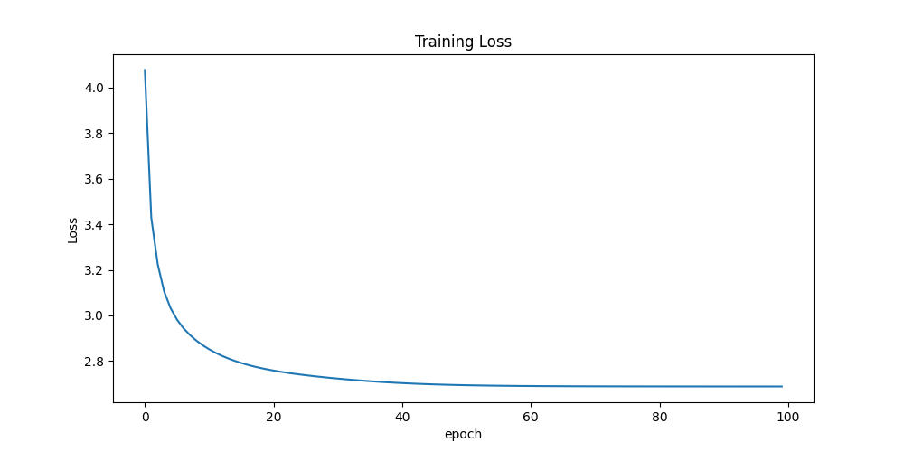
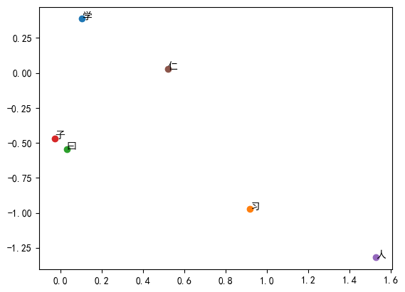
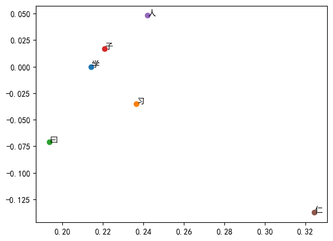
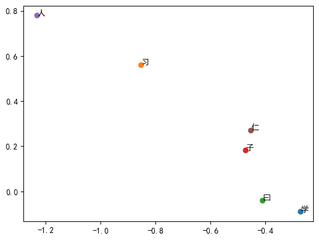
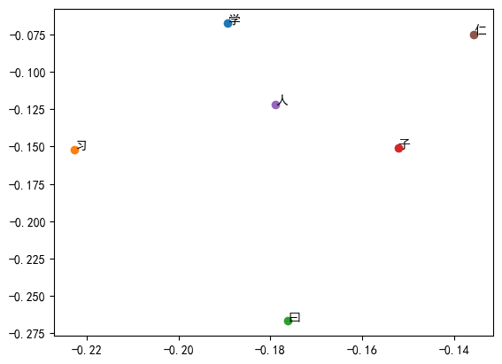
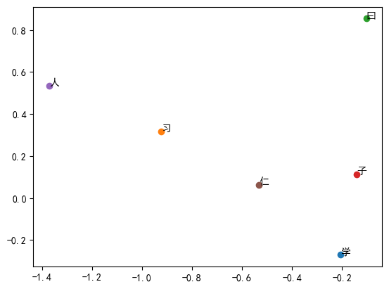
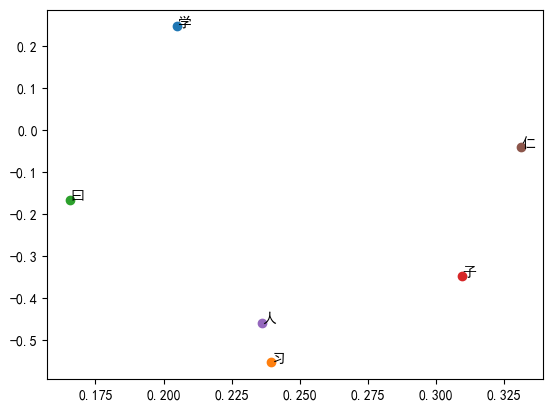
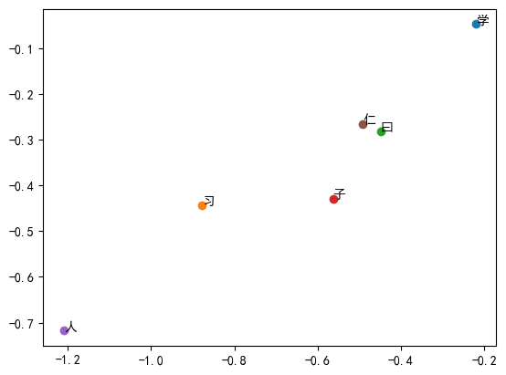
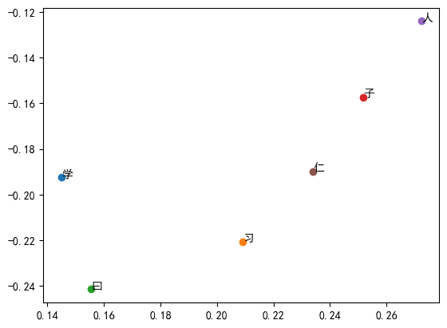
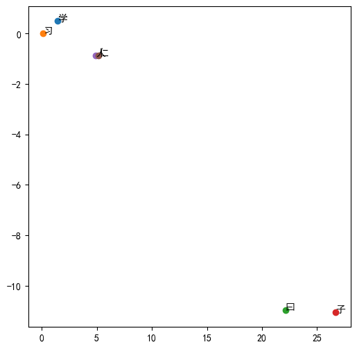

# Experiment Report

## 1. Reqiurement 3

### a. Screenshot of loss curve

### b. Briefly describe how to determine the training epochs

I initially train 100 epochs, and it takes over 30 minutes. Though I found that the loss curve is still lightly decreasing, I decided to stop the training because it takes too long. I think the model is already trained well enough by 50 epochs.

## 2. Requirement 5

### a. Embedding results

- emb_size:50, k:2, window_size:1

- emb_size:50, k:2, window_size:3

- emb_size:50, k:5, window_size:1

- emb_size:50, k:5, window_size:3

- emb_size:100, k:2, window_size:1

- emb_size:100, k:2, window_size:3

- emb_size:100, k:5, window_size:1

- emb_size:100, k:5, window_size:3

### Compare with lab4

The smallest loss occurs when emb_size:100, k:2, window_size:1. The loss is 0.8103.

- lab4: LSA

- We can see that "曰" is further from other words in the word2vec result. However, in the LSA result, "曰" is closer to other words.

- The word2vec result is more sparse than the LSA result.
