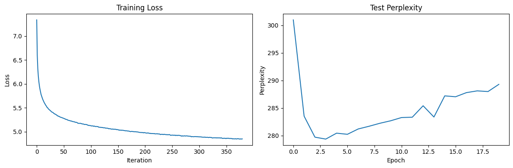
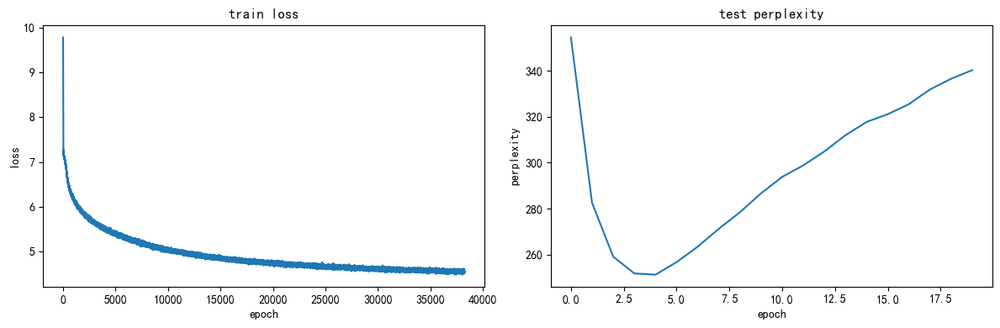
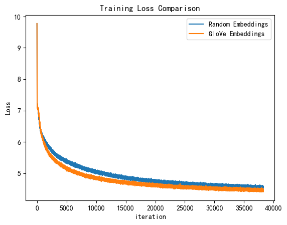

# Experiment Report

## 1. Task 3

### RNN

Prefix: Harry looked at
Generated: harry looked at the bottom of the castle .but somehow seemed to share left said hagrid .you didnt cure snape .frustration .i might have been going back to power for something after in tonight .thank you a source of rotten which will have popped through the decree in the first year .you havent

Prefix: Harry looked over
Generated: harry looked over it or not having not had much to finish .mr weasley ?said dumbledore in disbelief but as he remembered the firebolt fell at him .explain no .all you need to get us said ginny s voice trembled with imminent influence of amusement at these .not i am afraid of the

Prefix: Harry looked around
Generated: harry looked around and headed deep around the street full of lanterns full of vapors .harry swept up for a few seconds before perhaps do it does ?said snape and about two times that fred looked up and harry in her stare .well but .i suppose a now arent you too every gettin

Prefix: Harry looked at the
Generated: harry looked at the hospital wing instead .professor mcgonagall had been ripped up his trousers .they made her important hand to go down it a bit between one that the found dumbledore still left trying to ask them how many people seemed to be any more black letters .just do it !just be sacked

Prefix: Harry looked at the door
Generated: harry looked at the door and began to work and ginny mess hard when the painting of a creature tweed inlaid looking up at her ?yes has been impossible less than he said hermione .he was getting no more than my full drawl in pain that an appointment to us company at anything in the

### LSTM

Prefix: Harry looked at
Generated: harry looked at the photograph of the fourteenth substance and though his head leapt into its tangled arms his head lingered them completely and sunken now moving as one of the wands soared open his wooden hand on the ground .his broom was askew .they were looking .its a good bit from his

Prefix: Harry looked over
Generated: harry looked over his shoulder and then reminded for some reason to go back out so that the scar did to open and more as they had shrunk off harrys shoulder maintaining the <UNK> from his arm and hurried forward too more very amusing .as they were over to the shop pitching the

Prefix: Harry looked around
Generated: harry looked around at ron .i thought whatever the connection will have got theyve gone at the world we just have given in you you want to kill it this bit and know he was buying enough to move with me remember this week under a lifelong hilt .he will have listened for

Prefix: Harry looked at the
Generated: harry looked at the other side of the door lighting the bard .all of harry enter his cabin and the two wailing puffing the lights .he paused across the room .all right nothing ?harry yelled as the knot he touched an extremely much moment he continued to pull up his moleskin chair .she wrenched

Prefix: Harry looked at the door
Generated: harry looked at the door to the topmost direction of the school a few seconds later the quidditch mark was patting their way through a hurry at the edge of his throat .at the fact that he wanted to rats or went out of the way at what or smashed him perhaps .the dursleys certainly

## 2. Task 4

### Loss

### Perplexity

- Random Embeddings Final Perplexity: 350.45683045604017
- GloVe Embeddings Final Perplexity: 354.7701542382459
- Best Random Embeddings Perplexity: 252.679727177254
- Best GloVe Embeddings Perplexity: 239.7205948494848